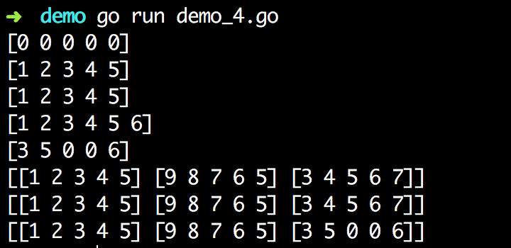

## 概述

数组是一个由固定长度的特定类型元素组成的序列，一个数组可以由零个或多个元素组成，一旦声明了，数组的长度就固定了，不能动态变化。

`len()` 和 `cap()` 返回结果始终一样。 

## 声明数组

```go
package main

import (
	"fmt"
)

func main() {
	//一维数组
	var arr_1 [5] int
	fmt.Println(arr_1)

	var arr_2 =  [5] int {1, 2, 3, 4, 5}
	fmt.Println(arr_2)

	arr_3 := [5] int {1, 2, 3, 4, 5}
	fmt.Println(arr_3)

	arr_4 := [...] int {1, 2, 3, 4, 5, 6}
	fmt.Println(arr_4)

    // 0:3 下标为0的位置赋值为3
	arr_5 := [5] int {0:3, 1:5, 4:6}
	fmt.Println(arr_5)

	//二维数组
	var arr_6 = [3][5] int {{1, 2, 3, 4, 5}, {9, 8, 7, 6, 5}, {3, 4, 5, 6, 7}}
	fmt.Println(arr_6)

	arr_7 :=  [3][5] int {{1, 2, 3, 4, 5}, {9, 8, 7, 6, 5}, {3, 4, 5, 6, 7}}
	fmt.Println(arr_7)

	arr_8 :=  [...][5] int {{1, 2, 3, 4, 5}, {9, 8, 7, 6, 5}, {0:3, 1:5, 4:6}}
	fmt.Println(arr_8)
}
```

运行结果：



## 注意事项

一、数组不可动态变化问题，一旦声明了，其长度就是固定的。

```go
var arr_1 = [5] int {1, 2, 3, 4, 5}
arr_1[5] = 6
fmt.Println(arr_1)
```
运行会报错：invalid array index 5 (out of bounds for 5-element array)

二、数组是值类型问题，在函数中传递的时候是传递的值，如果传递数组很大，这对内存是很大开销。

```go
//demo_5.go
package main

import (
	"fmt"
)

func main() {
	var arr =  [5] int {1, 2, 3, 4, 5}
	modifyArr(arr)
	fmt.Println(arr)
}

func modifyArr(a [5] int) {
	a[1] = 20
}
```

运行结果：


```go
//demo_6.go
package main

import (
	"fmt"
)

func main() {
	var arr =  [5] int {1, 2, 3, 4, 5}
	modifyArr(&arr)
	fmt.Println(arr)
}

func modifyArr(a *[5] int) {
	a[1] = 20
}
```

运行结果：


三、数组赋值问题，同样类型的数组（长度一样且每个元素类型也一样）才可以相互赋值，反之不可以。

```go
var arr =  [5] int {1, 2, 3, 4, 5}
var arr_1 [5] int = arr
var arr_2 [6] int = arr
```

运行会报错：cannot use arr (type [5]int) as type [6]int in assignment

## 复制数组

```go
package main

import "fmt"

func main() {
    src := []int{1, 2, 3, 4, 5}
    dst := make([]int, 5)

    numberOfElementsCopied := copy(dst, src)
    fmt.Printf("Number Of Elements Copied: %d\n", numberOfElementsCopied)
    fmt.Printf("dst: %v\n", dst)
    fmt.Printf("src: %v\n", src)

    //After changing numbers2
    dst[0] = 10
    fmt.Println("\nAfter changing dst")
    fmt.Printf("dst: %v\n", dst)
    fmt.Printf("src: %v\n", src)
}
```