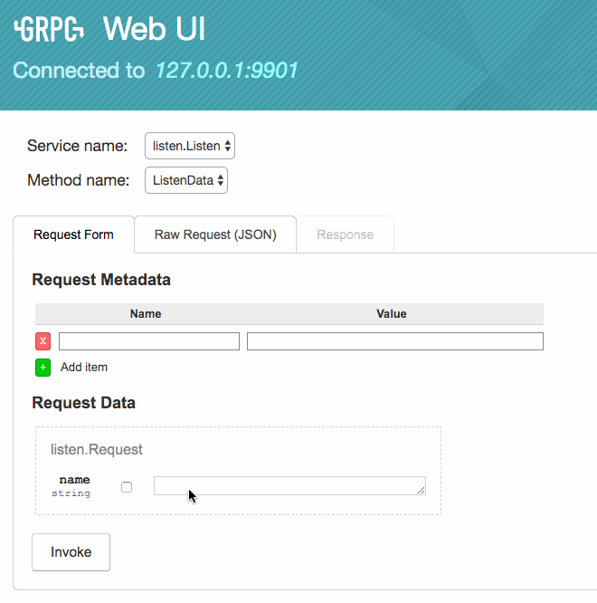

## 概述

最近这段时间工作挺忙的，发现已经 3 周没更文了...

感谢你们还在，今天给大家分享一款 gRPC 的调试工具。

进入正题。


当我们在写 HTTP 接口的时候，使用的是 Postman 进行接口调试，那么在写 gRPC 接口的时候，有没有类似于 Postman 的调试工具呢？


这是有的。

咱们一起看下 `grpcui`，源码地址：

https://github.com/fullstorydev/grpcui

看下官方描述：

> grpcui is a command-line tool that lets you interact with gRPC servers via a browser. It's sort of like Postman, but for gRPC APIs instead of REST.

## 写一个 gRPC API

我原来写过 Demo，可以直接用原来写的 listen 项目。

端口：9901

`.proto` 文件：

```go
syntax = "proto3"; // 指定 proto 版本

package listen;     // 指定包名

// 定义服务
service Listen {

	// 定义方法
	rpc ListenData(Request) returns (Response) {}

}

// Request 请求结构
message Request {
	string name = 1;
}

// Response 响应结构
message Response {
    string message = 1;
}
```

很简单，这个大家一看就知道了。

- Service name 为 listen.Listen
- Method name 为 ListenData

再看下 ListenData 方法：

```go
func (l *ListenController) ListenData(ctx context.Context, in *listen.Request) (*listen.Response, error) {
	return &listen.Response{Message : fmt.Sprintf("[%s]", in.Name)}, nil
}
```

这表示，将 `Name` 直接返回。

源码地址：

https://github.com/xinliangnote/go-jaeger-demo/tree/master/listen

#### 启动服务

```sh
cd listen && go run main.go
```

服务启动成功后，等待使用。

## grpcui 使用

#### 安装

根据官方 `README.md` 文档安装即可。

```sh
go get github.com/fullstorydev/grpcui
go install github.com/fullstorydev/grpcui/cmd/grpcui
```

这时，在 `$GOPATH/bin` 目录下，生成一个 `grpcui` 可执行文件。

执行个命令，验证下：

```
grpcui -help
```

输出：

```
Usage:
	grpcui [flags] [address]
	
......	
```

表示安装成功了。

#### 运行

```
grpcui -plaintext 127.0.0.1:9901

Failed to compute set of methods to expose: server does not support the reflection API
```

这种情况下，加个反射就可以了，在 listen 的 main.go 新增如下代码即可：

```go
reflection.Register(s)
```

在运行一次试试：

```
grpcui -plaintext 127.0.0.1:9901
gRPC Web UI available at http://127.0.0.1:63027/
```

在浏览器中访问：`http://127.0.0.1:63027/`



到这，我们看到 Service name、Method name 都出来了，传输参数直接在页面上进行操作即可。

当发起 Request "Tom"，也能获得 Response “Tom”。

当然，如果这个服务下面有多个 Service name，多个 Method name 也都会显示出来的，去试试吧。

## go-gin-api 系列文章

- [7. 路由中间件 - 签名验证](https://mp.weixin.qq.com/s/0cozELotcpX3Gd6WPJiBbQ)
- [6. 路由中间件 - Jaeger 链路追踪（实战篇）](https://mp.weixin.qq.com/s/Ea28475_UTNaM9RNfgPqJA)
- [5. 路由中间件 - Jaeger 链路追踪（理论篇）](https://mp.weixin.qq.com/s/28UBEsLOAHDv530ePilKQA)
- [4. 路由中间件 - 捕获异常](https://mp.weixin.qq.com/s/SconDXB_x7Gan6T0Awdh9A)
- [3. 路由中间件 - 日志记录](https://mp.weixin.qq.com/s/eTygPXnrYM2xfrRQyfn8Tg)
- [2. 规划项目目录和参数验证](https://mp.weixin.qq.com/s/11AuXptWGmL5QfiJArNLnA)
- [1. 使用 go modules 初始化项目](https://mp.weixin.qq.com/s/1XNTEgZ0XGZZdxFOfR5f_A)

